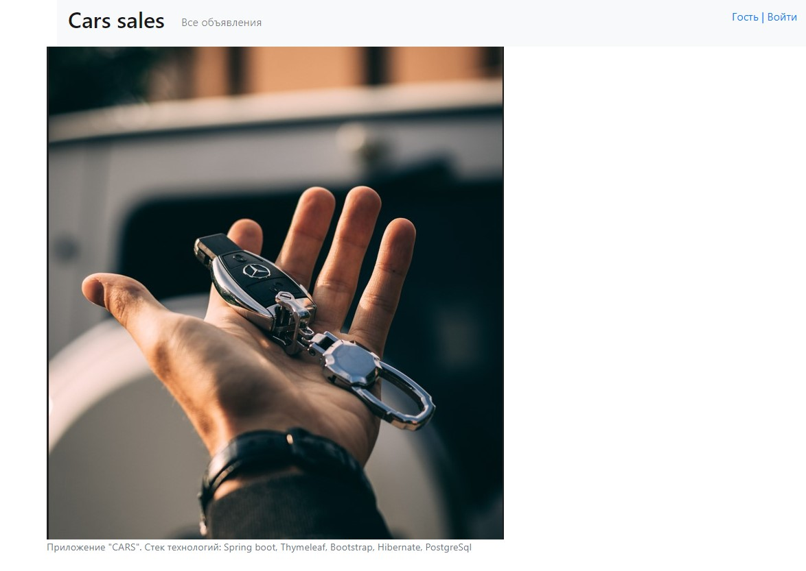
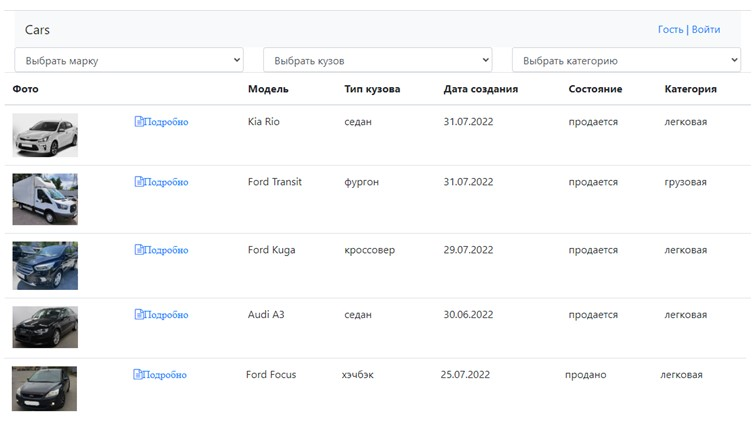
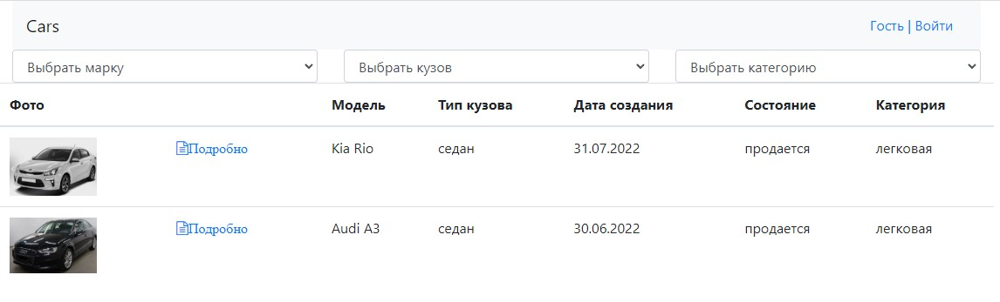
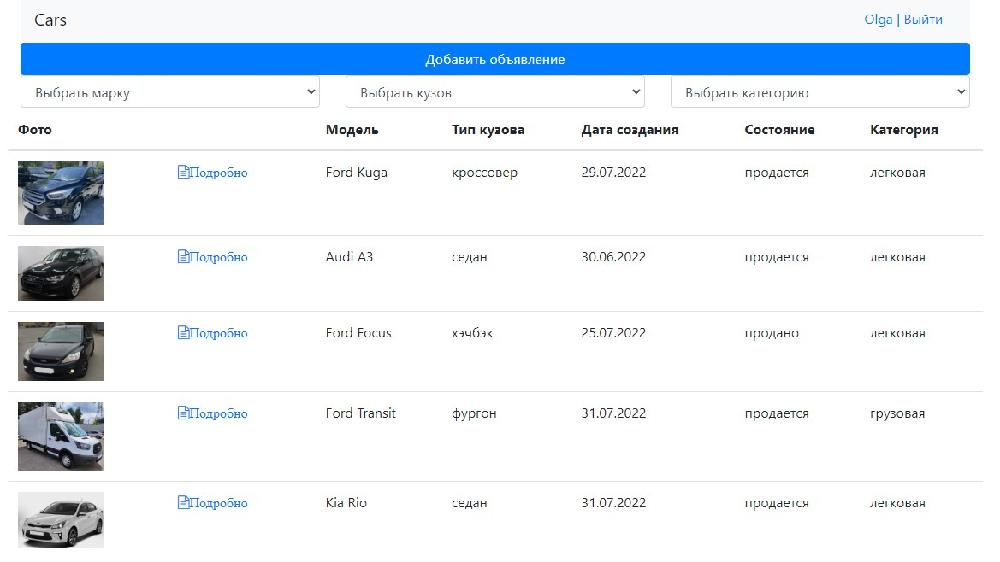
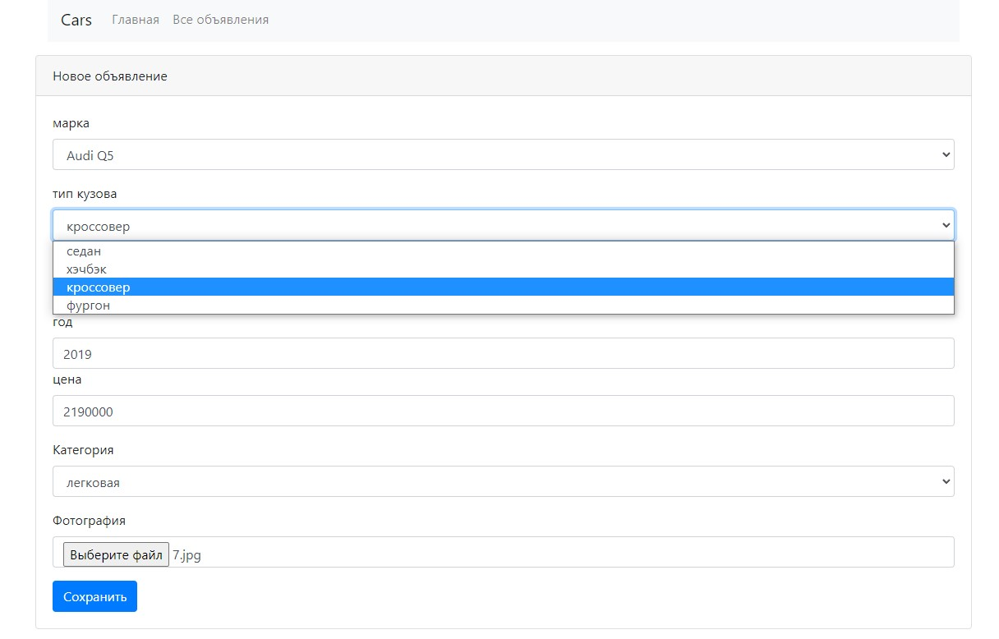
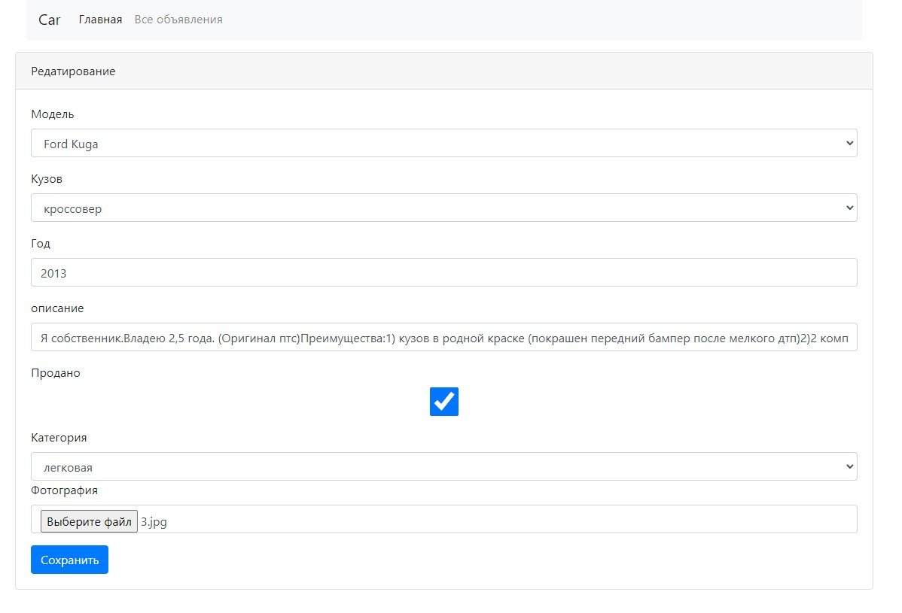

О проекте
web приложение для продажи машин "Cars sales".

Стек технологий: Spring boot, Thymeleaf, Bootstrap, Hibernate, PostgreSql
Объявления о прoдаже содержат: описание, марку машины, тип кузова, фото.

.jpg)
.jpg)
.jpg)
